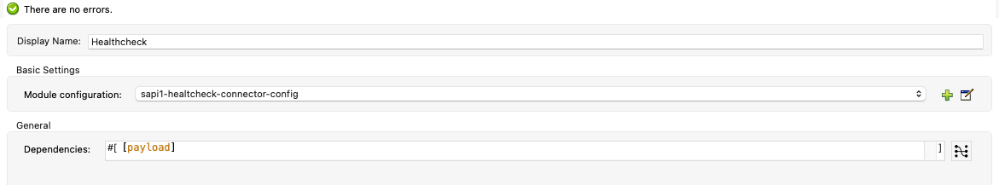

# Healthcheck Extension

## 1.0.0 version - Release notes

New Features:
* (tmp) 

Improvements:
* (tmp)

Bug fixes:
* (tmp)

## Operations

### healthcheck:create-healthcheck-object

It creates the healthcheck object from the connector config and a list of dependencies performing some logic :
- bubbling up of dependencies errors
- computation of the time as the maximum of the time of the dependencies
- set of HEALTHY/UNHEALTHY in the "status" field

|Parameter|Note|
|---|---|
|Dependencies|List of Healthcheck Object that represents the dependencies of the service|

### healthcheck:http

Performs an HTTP request with the specified parameters in the input and return an Healthcheck Object based on the outcome of the response.

|Parameter|required|Note|
|---|---|---|
|Service Name|true|Name of the service|
|HTTP Module Configuration|true|Indicate which HTTP request config should be used with this health check.|
|Method|true|HTTP method to perform on external system|
|Path|true|Path where the request will be sent|
|Headers|false|HTTP headers the message should include.|
|URI Params|false|URI parameters that should be used to create the request.|
|Http query params|false|Query parameters the request should include.|

### healthcheck:db

Performs the query specified as a parameter and returns an Healthcheck Object based on the outcome of the response.

|Parameter|required|Note|
|---|---|---|
|Service Name|true|Name of the service|
|DB Module Configuration|true|Indicates which DB config should be used with this healthcheck.|
|SQL Query Text|true|The query to perform|

### healthcheck:jms

Performs the following action on an specified queue:
- publish a message
- consume the message

and returns an Healthcheck Object based on the outcome of the response.

|Parameter|required|Note|
|---|---|---|
|Service Name|true|Name of the service|
|JMS Module Configuration|true|Indicates which JMS config should be used with this health check.|
|Queue Destination|true|The queue to be used for performing health check|

### healthcheck:amqp

Performs the following action on an specified exchange and queue:
- publish a message
- consume the message

and returns an Healthcheck Object based on outcome of the response.

|Parameter|required|Note|
|---|---|---|
|Service Name|true|Name of the service|
|AMQP Module Configuration|true|Indicate which AMQP config should be used with this health check.|
|Exchange Name|true|The exchange to use for performing health check|
|Queue Destination|true|The queue to use for performing health check|

### healthcheck:internal-services (to-review)

|Parameter|required|Note|
|---|---|---|
|applyCustomMapping|true|Whetever the script specified in the custom-mapping parameter should be used to extract Healthcheck object from internal services|
|custom-mapping|true|Dataweave script to extract Healtcheck Object from internal services |

### healthcheck:hc-scope (to-review)
A custom scope that returns an Healthcheck Object based on the outcome of the processor contained.

|Parameter|required|Note|
|---|---|---|
|Service Name|true|Name of the service|
|Service Type|true|Type of the service|

